<!-- status: historical
     verified: 2026-09-30 (link paths only: the architecture-2026-05 links point at archive/, where those files moved; nothing else re-checked)
     verified: 2026-06-12 (the deployed-config drift banner below — still the correct
     reading) · 2026-08-15 §13 ONLY — the ten "open implementation questions" were checked
     against what actually shipped and every one of them is now answered on-chain; see the
     note added at §13. The design body was NOT re-verified against the built blueprint.
     supersedes: none (pre-dates the header rule)
     NB: historical because this is the PRE-BUILD design — the blueprint it specifies was
     built, deployed and has since diverged. Ground truth for anything actionable is
     ESCROW-ADDRESSES.md (addresses/live config) and ESCROW-PARAMETER-SHEET.md (parameters).
     Archiving is a human call: this is the only record of the cherry-pick provenance and
     the Wave-2 PR sequence. -->

# Escrow Design — Radix Guild Marketplace Escrow v1

**Mission.** The tightest task-escrow blueprint on Radix for human + agent workers. Multi-token, dual-vault (reward + insurance), pluggable arbiter, agent-aware timers, events-only composability, no cross-chain, no protocol fee. Cherry-picked from `guild-escrow` + `task-escrow-v3` + `task-escrow` legacy + reference patterns + 2026-05-23 audit lessons.

**Status.** Design doc. Wave 2 implementation reference. To be reviewed against `docs/SCRYPTO-AUTH-CONVENTION.md` (PR #50) before code.
> ⚠️ **Deployed-config drift (noted 2026-06-12):** this doc predates deployment. Where it
> disagrees with `ESCROW-ADDRESSES.md` (e.g. dispute auto-resolve window: 14d here, **72h
> deployed**; arbiter fee: 10% here is the *cap*, per-task fee is 0 at launch), the
> ADDRESSES file is ground truth. Parameters + vNext2 plans: `ESCROW-PARAMETER-SHEET.md`.

**Replaces.** The "deprecate guild-escrow + delete task-escrow legacy" plan from `docs/architecture-2026-05/PLAN.md` Wave 2. New plan: build THIS escrow as the canonical, retire others as it absorbs their capability.

---

## 1. Locked decisions (Q1-Q7 from 2026-05-23 design session)

| # | Decision |
|---|----------|
| Q1 | Multi-token with owner-managed whitelist + per-token min + frozen flag |
| Q2 | No protocol fee. Dual-vault per task (reward + insurance). Insurance funds arbiter. |
| Q3 | Built-in dispute methods, pluggable arbiter via badge resource at instantiate, auto-resolve window |
| Q4 | Same role for agents + humans, per-badge submit deadline, claim_bond posted at claim, heartbeat extends |
| Q5 | Radix-native, subnet-portable (all addresses parameterized at instantiate). No cross-chain in v1. |
| Q6 | Subintent-compatible (bucket-passing, no callback deps). No first-class subintent flows in v1. |
| Q7 | Events emitted on every state transition. No hardcoded external calls. |

---

## 2. Resources owned by the blueprint

| Resource | Type | Supply | Mutability | Used for |
|----------|------|--------|-----------|----------|
| Owner badge | Fungible, divisibility none | 1 | Immutable | Whitelist mutations, arbiter-badge config, instance shutdown |
| Task receipt NFT | Non-fungible (Integer ID) | One per task | Data-mutable by component-owned minter | Proves task ownership for poster; carries `TaskInfo` |
| Claim receipt NFT | Non-fungible (Integer ID, same domain as task receipt) | One per claim (1:1 with task during claimed state) | Burned on submit / refund / expire | Proves claim ownership for worker; carries `ClaimInfo` |
| Internal minter badge | Fungible, divisibility none | 1 | Held in `minter_vault` (deny_all withdraw) | Authorizes mint/burn of receipts inside the blueprint |

**No new resources for arbiter, member, or agent badges** — those live in `radix-badge-manager` and are passed in at instantiate as resource addresses.

---

## 3. Component state

```rust
struct Escrow {
    // ── Config (set at instantiate, mutable only via owner) ──
    /// Accepted tokens: resource_address → (min_amount, frozen flag)
    accepted_tokens: KeyValueStore<ResourceAddress, AcceptedTokenConfig>,
    /// Resource address of the badge that gates the `worker` role for claim_task
    worker_badge_resource: ResourceAddress,
    /// Resource address of the badge that gates the `arbiter` role for resolve_dispute
    arbiter_badge_resource: ResourceAddress,
    /// Resource address of the badge that gates the `agent` role (subset of worker)
    /// — None means no agent-specific timer, treat all workers as humans
    agent_badge_resource: Option<ResourceAddress>,
    /// Ceiling on arbiter_fee_pct at task creation (0..=50)
    max_arbiter_fee_pct: Decimal,
    /// Default submit deadlines per worker type (in seconds)
    human_submit_deadline_secs: u64,    // 604800 = 7 days
    agent_submit_deadline_secs: u64,    // 86400 = 1 day
    /// Auto-resolve window for disputes (in seconds; 1209600 = 14 days)
    dispute_auto_resolve_secs: u64,
    /// Auto-resolve default: who wins if arbiter doesn't act in window
    dispute_auto_resolve_default: AutoResolveDefault,
    /// Minimum insurance as fraction of reward (0..=1; 0.05 = 5%)
    min_insurance_fraction: Decimal,
    /// Claim bond per task (single fungible amount per claim; in XRD)
    claim_bond_xrd: Decimal,
    /// Heartbeat fee deducted from claim_bond per heartbeat call (in XRD)
    heartbeat_fee_xrd: Decimal,
    /// Heartbeat extension granted per call (in seconds)
    heartbeat_extension_secs: u64,

    // ── State (per-task) ──
    /// Per-task vault for the reward token
    task_reward_vaults: KeyValueStore<u64, Vault>,
    /// Per-task vault for insurance (in same token as reward)
    task_insurance_vaults: KeyValueStore<u64, Vault>,
    /// Per-task vault for claim_bond (always XRD)
    task_claim_bond_vaults: KeyValueStore<u64, Vault>,
    /// Per-task metadata
    tasks: KeyValueStore<u64, TaskInfo>,
    /// Forfeited claim bonds accumulate here (owner-claimable)
    forfeited_claim_bonds_vault: Vault,

    // ── Internal ──
    minter_vault: Vault,
    task_receipt_manager: NonFungibleResourceManager,
    next_task_id: u64,
}

#[derive(ScryptoSbor, Clone)]
struct AcceptedTokenConfig {
    min_amount: Decimal,
    frozen: bool,
}

#[derive(ScryptoSbor)]
enum AutoResolveDefault {
    FavorDisputeRaiser,
    SplitEvenly,
    ReturnToPoster,
}

#[derive(ScryptoSbor)]
struct TaskInfo {
    poster: ComponentAddress,
    reward_token: ResourceAddress,
    reward_amount: Decimal,
    insurance_amount: Decimal,           // in same token as reward
    arbiter_fee_pct: Decimal,            // snapshot at create (0..=max_arbiter_fee_pct)
    work_brief_hash: Hash,               // points to off-chain spec
    created_at: Instant,
    state: TaskState,
    // Set when claimed
    claimer_badge_id: Option<NonFungibleLocalId>,
    claim_deadline: Option<Instant>,
    claimer_is_agent: bool,
    // Set when submitted
    submit_evidence_hash: Option<Hash>,
    submitted_at: Option<Instant>,
    // Set when disputed
    dispute_raised_by: Option<DisputeParty>,
    dispute_raised_at: Option<Instant>,
    dispute_evidence_hash: Option<Hash>, // optional supplementary evidence
}

#[derive(ScryptoSbor, PartialEq)]
enum TaskState {
    Open,
    Claimed,
    Submitted,
    Disputed,
    Released,
    Refunded,
    Expired,
}

#[derive(ScryptoSbor)]
enum DisputeParty {
    Poster,
    Worker,
}
```

---

## 4. State machine

```mermaid
stateDiagram-v2
    [*] --> Open: create_task(reward+insurance)
    Open --> Open: cancel_task→Refunded
    Open --> Claimed: claim_task(badge_bucket, claim_bond)
    Claimed --> Open: expire_claim (after claim_deadline; forfeits bond)
    Claimed --> Refunded: cancel_task_by_poster (worker gets bond back, reward returned)
    Claimed --> Submitted: submit_task(evidence_hash)
    Submitted --> Released: approve_and_release (poster happy path)
    Submitted --> Disputed: raise_dispute (poster OR worker)
    Disputed --> Released: resolve_dispute(PayWorker)
    Disputed --> Refunded: resolve_dispute(RefundPoster)
    Disputed --> Released: resolve_dispute(Split{w,p})
    Disputed --> Released: auto_resolve_dispute (after dispute_auto_resolve_secs)
    Released --> [*]
    Refunded --> [*]
    Expired --> [*]
```



**Terminal states:** `Released`, `Refunded`, `Expired`. Vaults are emptied at transition into terminal state; no re-entry possible.

---

## 5. Method inventory

Each method shows: auth pattern (per [`SCRYPTO-AUTH-CONVENTION.md`](SCRYPTO-AUTH-CONVENTION.md) — bucket-burn / caller-id-on-Proof / OWNER / verify_parent), state transitions, events, and fee/insurance flow.

### 5a. Configuration (owner-only)

| Method | Auth | Effect | Events |
|--------|------|--------|--------|
| `instantiate(...)` | (constructor) | Build escrow with all config params. Mint owner badge. | `EscrowInstantiated` |
| `add_accepted_token(resource: ResourceAddress, min_amount: Decimal)` | `OWNER` | Whitelist entry, frozen=false | `TokenWhitelisted` |
| `remove_accepted_token(resource: ResourceAddress)` | `OWNER` | Fails if any open task uses it | `TokenRemoved` |
| `freeze_token(resource: ResourceAddress)` | `OWNER` | Marks frozen. Existing tasks unaffected; new deposits blocked. | `TokenFrozen` |
| `unfreeze_token(resource: ResourceAddress)` | `OWNER` | Unfreezes | `TokenUnfrozen` |
| `withdraw_forfeited_bonds() -> Bucket` | `OWNER` | Empties forfeited bond vault | `ForfeitedBondsWithdrawn` |

### 5b. Task lifecycle (workers + posters)

| Method | Auth | State transition | Vaults touched | Events |
|--------|------|------------------|-----------------|--------|
| `create_task(reward: Bucket, insurance: Bucket, arbiter_fee_pct: Decimal, work_brief_hash: Hash) -> Bucket` | PUBLIC | new task at `Open` | + reward + insurance | `TaskCreated{task_id, poster, reward_token, reward_amount, insurance_amount, arbiter_fee_pct, work_brief_hash}` |
| `cancel_task(receipt: Bucket)` (state=Open) | **bucket-burn** receipt | Open→Refunded | reward + insurance returned to poster account | `TaskCancelled{task_id}` |
| `claim_task(task_id: u64, worker_badge: Bucket, claim_bond: Bucket) -> Bucket` | **bucket-burn** worker_badge + bond into vault | Open→Claimed | + claim_bond | `TaskClaimed{task_id, claimer_badge_id, is_agent, claim_deadline}` |
| `heartbeat(task_id: u64, claim_receipt: Proof)` | caller-id-on-Proof | extend claim_deadline; deduct heartbeat_fee from claim_bond vault | claim_bond decrements | `ClaimHeartbeat{task_id, new_deadline, remaining_bond}` |
| `expire_claim(task_id: u64)` (after deadline, any caller) | PUBLIC | Claimed→Open; forfeit claim_bond | claim_bond → forfeited_claim_bonds_vault; reward + insurance stay in escrow | `ClaimExpired{task_id, forfeited_bond_amount}` |
| `cancel_task_by_poster_after_claim(task_id: u64, receipt: Bucket)` | **bucket-burn** receipt | Claimed→Refunded | claim_bond → worker (back); reward + insurance → poster | `TaskCancelledAfterClaim{task_id}` |
| `submit_task(task_id: u64, claim_receipt: Bucket, evidence_hash: Hash)` | **bucket-burn** claim_receipt | Claimed→Submitted | claim_bond returned to worker | `WorkSubmitted{task_id, evidence_hash, submitted_at}` |
| `approve_and_release(task_id: u64, receipt: Bucket)` | **bucket-burn** receipt | Submitted→Released | reward → worker; insurance → poster (back, unused) | `TaskReleased{task_id, ruling: PayWorker, fee_taken: 0}` |
| `raise_dispute(task_id: u64, party_proof: Proof, dispute_evidence_hash: Option<Hash>)` | caller-id-on-Proof + proof of poster or claimer | Submitted→Disputed | none (just metadata) | `DisputeRaised{task_id, raised_by, dispute_evidence_hash}` |
| `resolve_dispute(task_id: u64, arbiter_badge: Bucket, ruling: DisputeRuling)` | **bucket-burn** arbiter_badge | Disputed→Released or Refunded | per ruling: split reward; arbiter takes `arbiter_fee_pct * insurance` as fee; rest of insurance per ruling | `DisputeResolved{task_id, ruling, arbiter_fee, ruling_party_amount}` |
| `auto_resolve_dispute(task_id: u64)` (after dispute_auto_resolve_secs, any caller) | PUBLIC | Disputed→Released or Refunded per `dispute_auto_resolve_default` | per default ruling; no arbiter fee taken | `DisputeAutoResolved{task_id, default_ruling}` |

### 5c. Views (no state change)

| Method | Auth | Returns |
|--------|------|---------|
| `get_task_info(task_id: u64)` | PUBLIC | `Option<TaskInfo>` (no balances) |
| `get_task_balances(task_id: u64)` | PUBLIC | `(reward_amount, insurance_amount, claim_bond_amount)` |
| `get_accepted_tokens()` | PUBLIC | `Vec<(ResourceAddress, AcceptedTokenConfig)>` |
| `get_config()` | PUBLIC | Frozen-view of all `instantiate` params |

### 5d. Dispute ruling enum

```rust
#[derive(ScryptoSbor, PartialEq)]
enum DisputeRuling {
    PayWorker,
    RefundPoster,
    Split { worker_pct: Decimal, poster_pct: Decimal }, // sum == 1.0
}
```

**Arbiter fee applies to insurance, not reward.** For all ruling variants, the arbiter takes `arbiter_fee_pct * insurance_amount` from `task_insurance_vaults[task_id]` as their fee. Remaining insurance is distributed per ruling (PayWorker→worker, RefundPoster→poster, Split→per percentages).

---

## 6. Auth applications (per `SCRYPTO-AUTH-CONVENTION.md`)

| Method | Pattern | Justification |
|--------|---------|---------------|
| `cancel_task`, `claim_task`, `cancel_task_by_poster_after_claim`, `submit_task`, `approve_and_release`, `resolve_dispute` | **Bucket-burn** | All one-shot state-changing methods. Badges/receipts are consumed; can't be replayed. |
| `heartbeat`, `raise_dispute`, view methods that need caller identity | **Caller-identity on Proof** | Cannot burn the badge/receipt (poster keeps task receipt across many heartbeats; raise_dispute needs the receipt to persist for follow-on actions). Verify Proof.owner == caller_address. |
| `add_accepted_token`, `remove_accepted_token`, `freeze_token`, `unfreeze_token`, `withdraw_forfeited_bonds` | OWNER | Standard `restrict_to: [OWNER]` |
| `create_task`, `get_*`, `expire_claim`, `auto_resolve_dispute` | PUBLIC | No badge needed. Anti-spam via deposit + claim_bond + heartbeat_fee. Auto-resolves are intentionally public (anyone can trigger after window). |

No `VERIFY_PARENT` methods in v1 (no relayer-style public mint pattern needed for escrow).

---

## 7. Custody model

Per `OPTIONS.md` Q5 — escrow is HIGH-tier (holds value). Owner role uses **AccessController with 7-day timed-recovery**.

```rust
// At instantiate
let owner_badge = ResourceBuilder::new_fungible(OwnerRole::None)
    .divisibility(DIVISIBILITY_NONE)
    .mint_initial_supply(1)
    .into();
let access_controller = AccessController::instantiate(
    primary_role: rule!(require(owner_badge.resource_address())),
    recovery_role: rule!(require(operator_secondary_resource)),
    timed_recovery_delay_minutes: 10080,  // 7 days
);
let escrow_owner = OwnerRole::Updatable(rule!(require(access_controller.address())));
```

For v1 deployments where operator does not yet have a secondary key: use `OwnerRole::Fixed(rule!(require(owner_badge)))` initially, document the AccessController upgrade in a separate runbook. Upgrade is `set_owner_role(new_rule)` callable by current owner.

---

## 8. Events (composability surface, per Q7)

All events carry `task_id` so consumers can correlate.

| Event | Emitted by | Carries |
|-------|------------|---------|
| `EscrowInstantiated` | instantiate | component_address, owner_badge_resource, worker_badge_resource, arbiter_badge_resource, agent_badge_resource |
| `TokenWhitelisted` | add_accepted_token | resource, min_amount |
| `TokenRemoved` | remove_accepted_token | resource |
| `TokenFrozen` | freeze_token | resource |
| `TokenUnfrozen` | unfreeze_token | resource |
| `TaskCreated` | create_task | task_id, poster, reward_token, reward_amount, insurance_amount, arbiter_fee_pct, work_brief_hash |
| `TaskCancelled` | cancel_task | task_id |
| `TaskClaimed` | claim_task | task_id, claimer_badge_id, is_agent, claim_deadline |
| `ClaimHeartbeat` | heartbeat | task_id, new_deadline, remaining_bond |
| `ClaimExpired` | expire_claim | task_id, forfeited_bond_amount |
| `TaskCancelledAfterClaim` | cancel_task_by_poster_after_claim | task_id |
| `WorkSubmitted` | submit_task | task_id, evidence_hash, submitted_at |
| `TaskReleased` | approve_and_release / resolve_dispute | task_id, ruling, arbiter_fee |
| `TaskRefunded` | resolve_dispute(RefundPoster) | task_id, arbiter_fee |
| `DisputeRaised` | raise_dispute | task_id, raised_by, dispute_evidence_hash |
| `DisputeResolved` | resolve_dispute | task_id, ruling, arbiter_fee, ruling_party_amount |
| `DisputeAutoResolved` | auto_resolve_dispute | task_id, default_ruling |
| `ForfeitedBondsWithdrawn` | withdraw_forfeited_bonds | amount |

No callbacks. Off-chain indexers (reputation, leaderboards, dispute analytics) consume the event stream.

---

## 9. Pre-audit checklist (applies the auth convention + audit lessons)

### From the 2026-05-23 audit reports

| Audit finding (source blueprint, severity) | How this design handles it |
|--------------------------------------------|---------------------------|
| `guild-escrow` F-001 worker role `allow_all` (High) | `claim_task` requires `worker_badge: Bucket` (burns), gates on resource match. `submit_task` requires `claim_receipt: Bucket` (burns), which was minted at claim. No public worker role. |
| `guild-escrow` F-002 arbiter role accepts any badge (High) | `arbiter_badge_resource` set at instantiate. `resolve_dispute` requires `arbiter_badge: Bucket` (burns), gates on resource match. Composite-level check optional via NFT data inspection. |
| `task-escrow-v3` F-001 fee retroactive (High) | `arbiter_fee_pct` snapshotted into `TaskInfo` at `create_task`. Owner can never change a task's fee after creation. |
| `task-escrow-v3` F-002 no slippage on deposits (High) | All payout methods use `try_deposit_or_abort` with `DepositRule::Accept`. If rejected, bucket is returned to caller (worker/poster) via the manifest; transaction can include fallback handling. |
| `task-escrow-v3` F-003..F-006 proof-vs-bucket (Medium x4) | All state-changing methods use bucket-burn per `SCRYPTO-AUTH-CONVENTION.md`. View methods use caller-id-on-Proof. |
| `radix-badge-manager` F-001 VERIFY_PARENT (Medium) | N/A for escrow (no public_mint-style method). |
| Owner-badge SPOF (3 blueprints, Medium) | AccessController + 7-day timed-recovery in custody section. |
| `task-escrow-v3` F-005/F-006 verifier can force-cancel/expire any task (Medium) | No verifier role in this design. Force-cancel is OWNER-only (still possible but rare); expire_claim and auto_resolve_dispute are time-gated PUBLIC (any caller, but only after deadline). |

### Class invariants

| Invariant | Enforced by |
|-----------|-------------|
| Total balance per task_id ≤ initial deposit | Per-task vaults, no cross-task transfers. Test asserts on every transition. |
| Once terminal, no further mutations | State enum check at the top of every mutating method (`assert!(task.state == X, ...)`). |
| Forfeited bonds are owner-recoverable but separated from active task funds | Dedicated `forfeited_claim_bonds_vault`; only `withdraw_forfeited_bonds` touches it. |
| Arbiter fee can never exceed `max_arbiter_fee_pct` | Validated at `create_task` against `TaskInfo.arbiter_fee_pct`. |
| Insurance fraction satisfies `min_insurance_fraction` of reward | Validated at `create_task`. |
| Claim bond is exactly `claim_bond_xrd` | Validated at `claim_task`. |
| Whitelist mutation cannot break in-flight tasks | `remove_accepted_token` rejects if any non-terminal task uses the token; `freeze_token` only blocks new deposits. |

---

## 10. Test surface

### 10a. Happy paths

1. Create task, cancel before claim → poster gets full refund.
2. Create task, claim, submit, approve_and_release → worker gets reward; poster gets insurance back; claim_bond returned to worker on submit.
3. Create task, claim, heartbeat once, submit, approve → claim_bond minus 1×heartbeat_fee returned.

### 10b. Dispute paths

4. Create, claim, submit, raise_dispute (by poster), resolve(PayWorker) → worker gets reward; arbiter gets arbiter_fee_pct of insurance; poster gets rest of insurance.
5. Same as 4 but resolve(RefundPoster) → poster gets reward + (insurance - arbiter_fee); arbiter gets arbiter_fee.
6. Same as 4 but resolve(Split{0.5, 0.5}) → reward split 50/50; insurance distributed per same %.
7. Create, claim, submit, raise_dispute, auto_resolve after window → applies `dispute_auto_resolve_default`; no arbiter fee.

### 10c. Failure paths

8. Create with token not in whitelist → rejects.
9. Create with frozen token → rejects.
10. Claim by holder of wrong badge_resource → rejects.
11. Submit by holder of wrong claim_receipt → rejects.
12. Approve_and_release by holder of wrong task_receipt → rejects.
13. Resolve_dispute by holder of wrong arbiter_badge → rejects.
14. Expire_claim before deadline → rejects.
15. Auto_resolve_dispute before window → rejects.
16. Re-claim after expire → succeeds (state back to Open).
17. Cancel_task on already-claimed task by poster (not via cancel_task_by_poster_after_claim) → rejects.
18. Owner add_accepted_token by non-owner → rejects.
19. Owner remove_accepted_token while open task uses it → rejects.

### 10d. Edge cases

20. Heartbeat with claim_bond too low to cover heartbeat_fee → rejects (`bond depleted`).
21. Submit deadline exactly = current_time → rejects (strict >).
22. Insurance == 0 (poster wants no dispute support) and dispute raised → still allowed, but arbiter fee is 0 (arbiter has no incentive).
23. Reward in token A, insurance in token B (currently disallowed — must be same token) → rejects.
24. Multi-task interleaving: claim task X, claim task Y by same worker → both work independently.

### 10e. Convention conformance

25. Bucket-burn methods actually burn (test asserts resource supply decremented).
26. View methods reject mismatched Proof.owner.

**Total: ~26 tests. ~800-1000 LOC test code.**

---

## 11. LOC + complexity estimate

| Section | LOC |
|---------|-----|
| `instantiate` + config getters | 100 |
| Token whitelist methods (add/remove/freeze/unfreeze/withdraw_forfeited) | 80 |
| Task lifecycle (create, cancel, claim, submit, approve_and_release, heartbeat, expire_claim, cancel_after_claim) | 400 |
| Dispute lifecycle (raise, resolve, auto_resolve) | 200 |
| View methods | 60 |
| Auth macro + role definitions | 60 |
| Events (struct defs) | 80 |
| Errors / asserts / invariants | 80 |
| **Source total** | **~1060** |
| Tests (26 tests, ~800-1000 LOC) | 900 |
| **Combined** | **~1960** |

For reference: guild-escrow is 1520 LOC (source + tests), task-escrow-v3 is 1176 LOC. This design is bigger because it absorbs both their capabilities + adds claim_bond + heartbeat + auto_resolve. Tightness comes from one blueprint vs three.

---

## 12. Migration from existing blueprints

Once this escrow is built + audited:

- **`guild-escrow`** → DEPRECATE (operator instruction was: don't delete). Mark with `#[deprecated]` comment + README notice. Keep in repo for reference but remove from default scrypto CI matrix. Existing deployed instances stay alive; new deployments use new escrow.
- **`task-escrow-v3`** → Same. DEPRECATE, do not delete.
- **`task-escrow` legacy** → Same. DEPRECATE, do not delete. (Was already slated for delete in plan; operator overrode.)
- **App/bot integrations** → Move to new escrow address as Wave 6/7 work lands. Existing escrow addresses stay live for existing tasks.

This preserves the existing audited surface (legacy escrows can hold legacy tasks) while moving new tasks to the new blueprint.

---

## 13. Open implementation questions for operator

> ⛔ **None of these are open, and five of the ten recommendations below were NOT what
> shipped (noted 2026-08-15).** Answered by the live component (`ESCROW-ADDRESSES.md`,
> Gateway-read) and re-affirmed by the signed `ESCROW-PARAMETER-SHEET.md` §"PULL cutover":
> Q1 `min_insurance_fraction` **0.05** (as recommended) · Q2 `max_arbiter_fee_pct` **0.1**,
> *not* the 0.5 recommended here · Q3 **604800** ✓ · Q4 **86400** ✓ · Q5
> `dispute_auto_resolve_secs` **259200 (72h)**, *not* the 14d recommended here · Q6
> `dispute_auto_resolve_default` **`SplitEvenly`**, *not* the `FavorDisputeRaiser`
> recommended here · Q7 `claim_bond_xrd` **10**, *not* 1 · Q8/Q9 heartbeat **removed
> entirely** by DB-3 — there is no heartbeat leg on the PULL blueprint, so both questions
> are void. Do not treat any parenthesised recommendation below as the deployed value.

These need a decision before code starts. Recommended defaults in parens.

1. **`min_insurance_fraction`** — what minimum insurance ratio do we enforce on `create_task`? (Recommended: 5% = 0.05, so a 100 XRD reward requires ≥ 5 XRD insurance. Set to 0 if optional disputes are OK.)
2. **`max_arbiter_fee_pct`** — ceiling for the arbiter cut from insurance? (Recommended: 50% = 0.5. Lets posters offer "winner-take-all" for arbiters if they want fast resolution.)
3. **`human_submit_deadline_secs`** — default for human-claimed tasks? (Recommended: 604800 = 7 days.)
4. **`agent_submit_deadline_secs`** — default for agent-claimed tasks? (Recommended: 86400 = 24 hours.)
5. **`dispute_auto_resolve_secs`** — how long does the arbiter have? (Recommended: 1209600 = 14 days.)
6. **`dispute_auto_resolve_default`** — default ruling if arbiter doesn't act? (Recommended: `FavorDisputeRaiser` — disincentivizes ghosting by arbiter, since whoever asked usually has the better-faith claim.)
7. **`claim_bond_xrd`** — claim bond per task in XRD? (Recommended: 1 XRD. Low enough not to deter genuine workers, high enough to deter spam-claiming.)
8. **`heartbeat_fee_xrd`** — fee per heartbeat call? (Recommended: 0.1 XRD. Small enough that a long-running agent task can heartbeat many times; large enough to discourage no-op calls.)
9. **`heartbeat_extension_secs`** — how much time per heartbeat? (Recommended: 86400 = 24 hours, matches agent default deadline. So one heartbeat doubles an agent's window.)
10. **Multi-token reward + same-token insurance** — should insurance be required to match the reward token, or can it always be XRD regardless of reward token? (Recommended: same as reward. Simpler accounting, avoids cross-token rate questions. Operator may want XRD-only insurance for predictability — that's also defensible.)

---

## 14. Wave 2 PR sequence for this design

Replaces the original Wave 2 in `PLAN.md`. Each PR ≤10 files, ≤500 LOC per the standing rule.

| # | Title | Scope | Files | LOC est | Depends on |
|---|-------|-------|-------|---------|------------|
| **2.1** | `feat(scrypto): scaffold guild-marketplace-escrow blueprint + instantiate + owner methods` | Empty blueprint scaffolding, owner badge mint, instantiate + token whitelist methods. No task methods. | new `blueprints/guild-marketplace-escrow/{Cargo.toml,src/lib.rs,tests/lib.rs}` | +250 src + 200 test | PR #50 (auth convention doc) |
| **2.2** | `feat(scrypto): task lifecycle methods (create, cancel, claim, submit, approve_and_release)` | Happy path methods + claim_bond logic + tests | modify src/lib.rs (+400), tests/lib.rs (+300) | +700 | 2.1 |
| **2.3** | `feat(scrypto): heartbeat + expire_claim + cancel_after_claim` | Agent-support methods + bond forfeiture | modify src/lib.rs (+150), tests/lib.rs (+150) | +300 | 2.2 |
| **2.4** | `feat(scrypto): dispute lifecycle (raise, resolve, auto_resolve)` | Disputes + arbiter fee + auto-resolve | modify src/lib.rs (+250), tests/lib.rs (+300) | +550 | 2.3 |
| **2.5** | `feat(scrypto): view methods + event emissions` | All views + ensure every state transition emits an event | modify src/lib.rs (+100), tests/lib.rs (+100) | +200 | 2.4 |
| **2.6** | `chore(scrypto): deprecate guild-escrow + task-escrow-v3 + task-escrow legacy (mark #[deprecated], leave in tree)` | Add deprecation comments + README notice; remove from default CI matrix | modify 3 blueprint dirs (README + lib.rs deprecation tags) | +30 / 0 | 2.5 |

**Total Wave 2:** 6 PRs, ~+2030 LOC. Each PR is independently mergeable + CI-green.

Note: PR 2.4 dispute lifecycle is the largest. May be worth splitting into 2.4a (raise_dispute + storage) and 2.4b (resolve_dispute + auto_resolve) if it threatens the 500-LOC ceiling.

---

## 15. References

- [`docs/SCRYPTO-AUTH-CONVENTION.md`](SCRYPTO-AUTH-CONVENTION.md) — auth patterns applied throughout
- `docs/architecture-2026-05/OPTIONS.md` Q4, Q5 — auth + custody recommendations
- `docs/architecture-2026-05/ARCHITECTURE.md` §5 — blueprint topology + capability badges
- Audit reports: `~/Projects/scrypto-audit-kit/audit-reports/*-2026-05-23.md` (guild-escrow, task-escrow-v3, radix-badge-manager, agent-badge-controller)
- Ignition role-hierarchy patterns: `~/Projects/scrypto-audit-kit/references/ignition-patterns.md` §Pattern 1 (auth), §Pattern 5 (state machines), §Pattern 8 (pre/post invariants)
- CaviarNine HyperStake patterns: per-task vault patterns + lazy NAV (KV-store keyed vault use is the relevant template)
- Existing blueprints (cherry-pick sources): `guild-public/blueprints/escrow/`, `guild-public/badge-manager/scrypto/task-escrow-v3/`, `guild-public/badge-manager/scrypto/task-escrow/`
